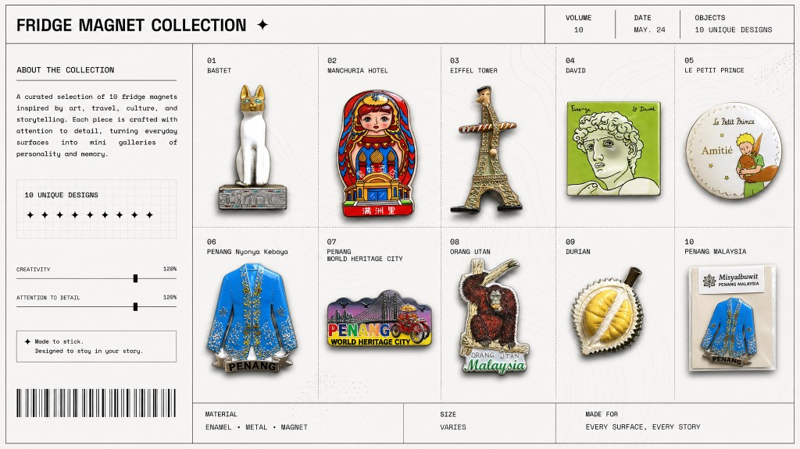

# koutu

Batch process product photos (e.g. fridge magnets, enamel pins): **AI background removal** + **collectible-grade** color grading.

批量处理产品照片（如冰箱贴、徽章、珐琅针）：**AI 抠图** + **收藏品级**调色。

Designed for flat-lay photos on a plain background. Output is PNG with transparency, brightened for catalog or collection display.

适用于纯色背景的平铺拍摄。输出带透明通道的 PNG，提亮后可直接用于目录或收藏展示。



## Features / 功能

- Background removal via [rembg](https://github.com/danielgatis/rembg) (U²-Net)
- 基于 [rembg](https://github.com/danielgatis/rembg)（U²-Net）的智能抠图
- Collectible look: exposure lift, mild warm tone, contrast / saturation / sharpness boost
- 收藏品质感：提亮、微暖色、对比度 / 饱和度 / 锐度增强
- Batch folder or single file
- 支持文件夹批量或单张处理
- Skip existing outputs (resume-friendly)
- 跳过已生成文件，可断点续跑

## Requirements / 环境要求

- Python 3.10+
- macOS / Linux / Windows
- First run downloads the `u2net` model (~176 MB)
- 首次运行会自动下载 `u2net` 模型（约 176 MB）

## Install / 安装

```bash
python3 -m venv .venv
source .venv/bin/activate   # Windows: .venv\Scripts\activate
pip install -r requirements.txt
```

## Usage / 用法

```bash
# Batch: input folder -> output folder
# 批量：输入文件夹 -> 输出文件夹
python batch_collectibles.py -i ./photos -o ./collectibles

# Recursive scan
# 递归扫描子目录
python batch_collectibles.py -i ./photos -o ./collectibles -r

# Single file
# 单张图片
python batch_collectibles.py -i ./one.jpg -o ./out

# Custom output suffix + overwrite
# 自定义输出后缀 + 覆盖已有文件
python batch_collectibles.py -i ./photos -o ./out --suffix "_收藏品.png" --force
```

## Output / 输出

- Format: PNG (RGBA, transparent background)
- 格式：PNG（RGBA，透明背景）
- Naming: `{original_stem}{suffix}` (default: `_collectible.png`)
- 命名：`{原文件名}{后缀}`（默认：`_collectible.png`）

## Pipeline / 处理流程

1. `rembg` removes background / `rembg` 去除背景
2. `collectible_grade()` adjusts RGB only (alpha preserved) / 仅调整 RGB（保留 alpha 通道）：
   - Exposure ×1.28 + offset 22 / 曝光 ×1.28 + 偏移 22
   - Slight warm shift (R ×1.02, B ×0.98) / 微暖色（R ×1.02，B ×0.98）
   - Contrast ×1.12, color ×1.18, sharpness ×1.2 / 对比度 ×1.12，色彩 ×1.18，锐度 ×1.2

Tune parameters in `collectible_grade()` if your lighting differs.

若拍摄光线不同，可在 `collectible_grade()` 中调整参数。

## Cursor Skill (koutu)

Included: `.cursor/skills/koutu/SKILL.md`

已内置：`.cursor/skills/koutu/SKILL.md`

Clone this repo and open it as the Cursor workspace root (or copy the skill to your workspace `.cursor/skills/koutu/`).

克隆本仓库并以 Cursor 工作区根目录打开（或将 skill 复制到你的 `.cursor/skills/koutu/`）。

In chat:「用 koutu 批量抠图做成收藏品」or mention 抠图 / 收藏品 / 冰箱贴.

在对话中说「用 koutu 批量抠图做成收藏品」，或提及 抠图 / 收藏品 / 冰箱贴。

## License

MIT
